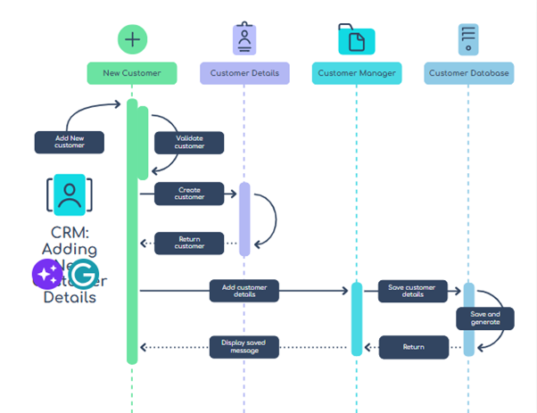

**Architecture**

**APIs and Methods**

1.	Authentication Routes:
○	POST /api/auth/login: Allows users to log in using their credentials (e.g., email and password).
○	POST /api/auth/register: Allows users to create an account by providing necessary details (e.g., email, password, etc.).
2.	Customer Routes:
○	GET /api/customers: Retrieves a list of all customers.
○	GET /api/customers/:id: Retrieves details of a specific customer by their unique ID.
○	POST /api/customers: Creates a new customer by providing relevant data (e.g., first name, last name, phone number, etc.).
○	PUT /api/customers/:id: Updates customer information (e.g., phone number, notes) for a specific customer.
○	DELETE /api/customers/:id: Deletes a customer from the database.
3.	GET /api/search/customers: Allows searching for customers based on a prefix-matched first name, last name, or phone number.
4.	Security and Authorization:
○	Implement middleware to ensure that only authenticated users can access certain routes (e.g., customer creation, creating new users to the database).
○	Use appropriate security rules to restrict access to sensitive data.

**Data Model**

**User Stories**

User Story: Managing Customer Information
As an administrator of the CRM system website, I want to be able to perform the following actions:
1.	Create Editor Users:
○	As an administrator, I should be able to create new editor users. These editor users will have permission to manage customer information.
○	The editor users can add new customer records, update existing customer details, and delete customer records.

2.	Search and List Customers:
○	Both administrators and editor users should be able to search for customers based on various criteria (e.g., name, email, phone number).
○	The system should provide a list view of customer records, displaying relevant information such as name, contact details, and other relevant data.
3.	Supervisor Role:
○	Additionally, the system administration should allow the creation of Supervisor users.
○	Supervisor users will have read-only access to customer information. They can search and view customer records but cannot modify them.
Acceptance Criteria:
●	The administrator can create editor and supervisor users with appropriate permissions.
●	Editor users can perform CRUD (Create, Read, Update, Delete) operations on customer records.
●	Both administrators and editor users can search for customers and view relevant details.
●	Supervisor users can only search for and view customer information without modification rights.

